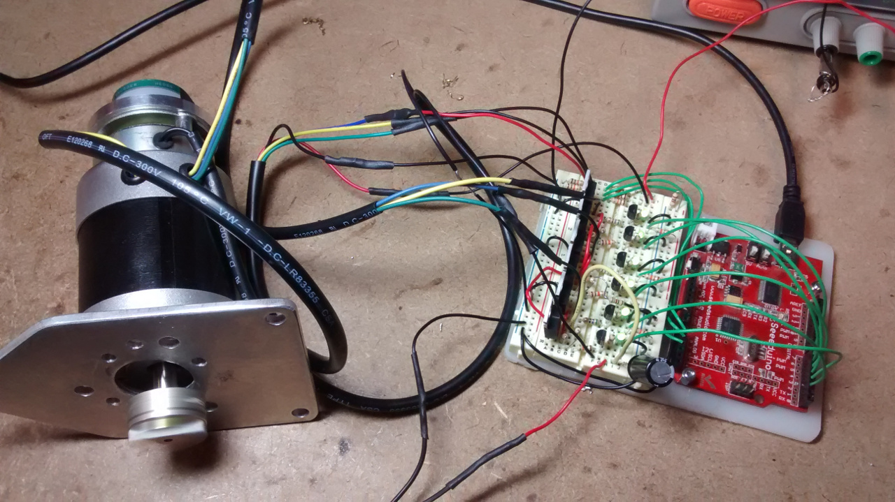
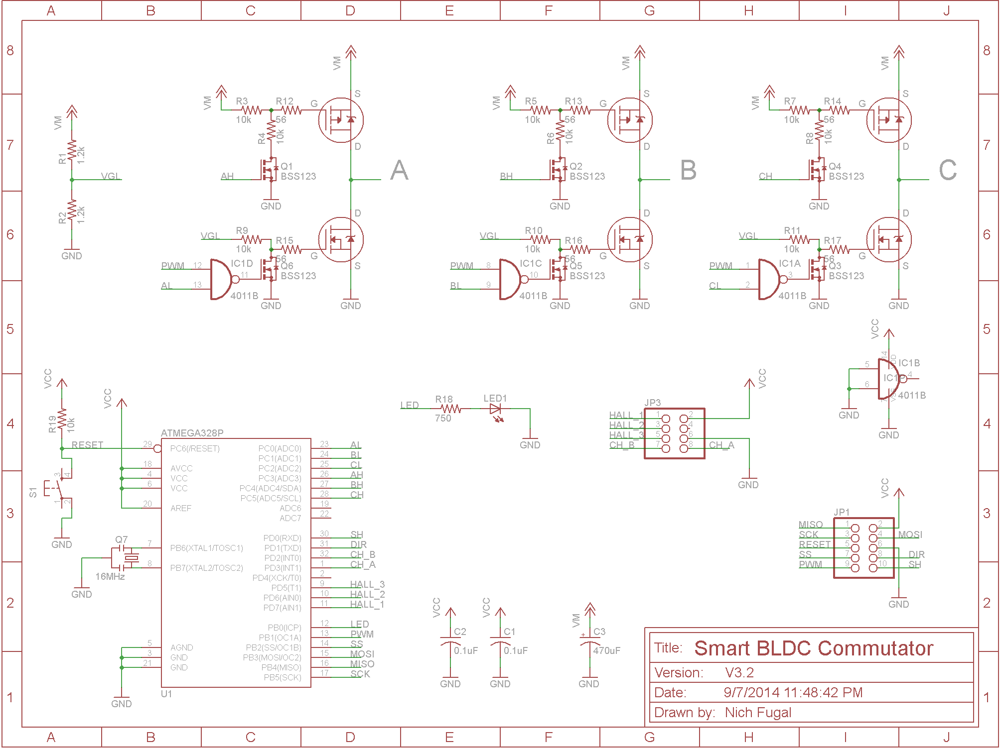
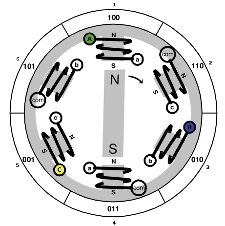
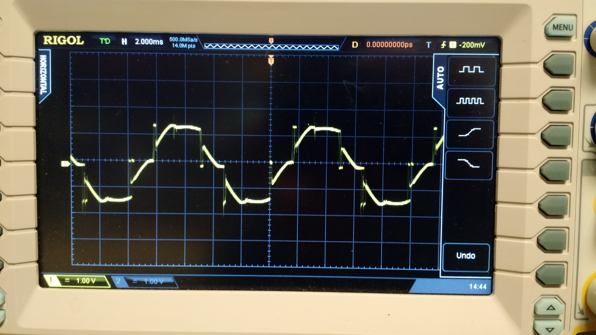
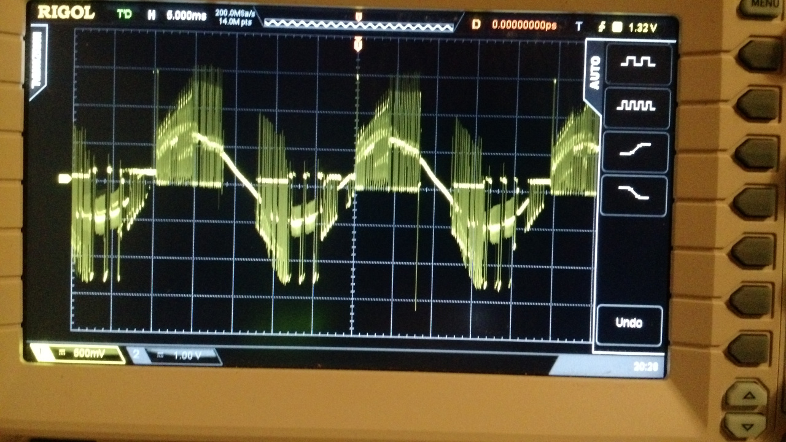
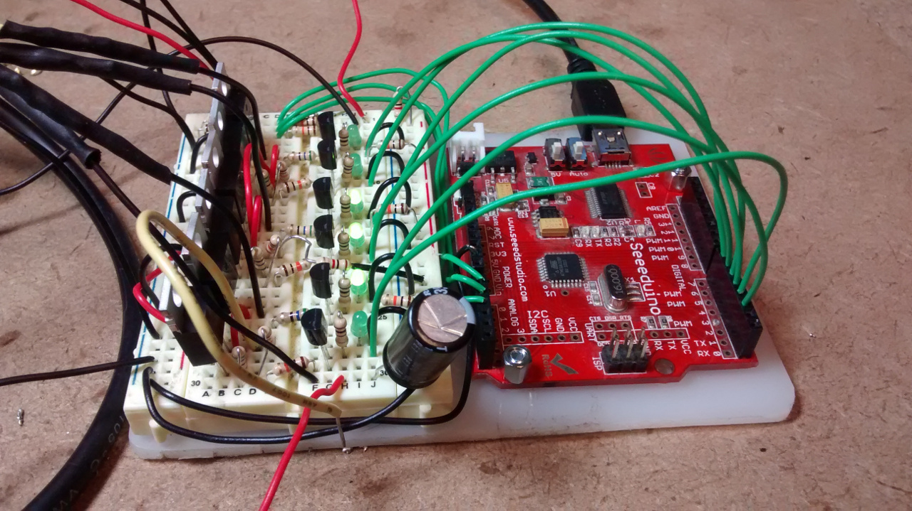
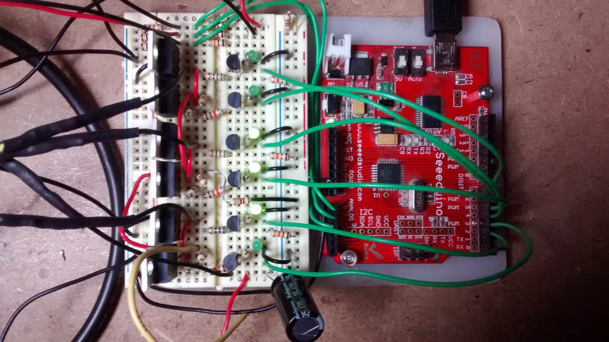

# BLDC Controller

This github repository documents learning about 3 phase sensored brushless DC motor control with the eventual aim of building an ebike controller

Video demo of basic arduino BLDC controller: [https://youtu.be/3LG14Kc8SRs](https://youtu.be/3LG14Kc8SRs)

### 1) Useful resources for getting started

- [Video by digitalPimple: Brushless DC Motors & Control - How it Works (Part 1 of 2)](https://www.youtube.com/watch?v=ZAY5JInyHXY)
- [Application note: AN857 Brushless DC Motor Control Made Easy - good explanation of sensored commutation](http://ww1.microchip.com/downloads/en/AppNotes/00857B.pdf) 

Makeatronics open source BLDC Motor controller explanation and design:

- [Makeatronics: BLDC Motor Control](http://makeatronics.blogspot.co.uk/2014/05/bldc-motor-control.html)
- [Makeatronics: Smart BLDC Commutator - Hardware](http://makeatronics.blogspot.co.uk/2014/08/smart-bldc-commutator-hardware.html)
- [Github: Smart-BLDC-Commutator-Hardware](https://github.com/fugalster/Smart-BLDC-Commutator-Hardware)
- [Github: Smart-BLDC-Commutator (Arduino firmware)](https://github.com/fugalster/Smart-BLDC-Commutator)

### 2) First prototype design based on Makeatronics schematic

First prototype based on Nich Fugal's (Makeatronics) schematic:

Using the following P-type Mosfet on the high sides, N-type Mosfets on the low sides and smaller N-type mosfets as gate drivers.

- [3x Low side Mosfets: IRF1404ZPBF TO-220](http://uk.farnell.com/webapp/wcs/stores/servlet/ProductDisplay?partNumber=8657394) 
- [3x High side Mosfets:  IRF4905PBF TO-220](http://uk.farnell.com/webapp/wcs/stores/servlet/ProductDisplay?partNumber=8648190) 
- [6x Gate driver Mosfets: BS270](http://uk.farnell.com/webapp/wcs/stores/servlet/ProductDisplay?partNumber=1017689)

The sensored brushless DC motor used was a 24V 134W motor (code: 57ZW3Y74A40) courtesy of [Ken Boak](http://sustburbia.blogspot.co.uk).

### 3) Commutation

*Modified from BLDC diagram: AN857 Brushless DC Motor Control Made Easy*

The [video by digitalPimple: Brushless DC Motors & Control - How it Works (Part 1 of 2)](https://www.youtube.com/watch?v=ZAY5JInyHXY) provides a useful visual overview of how commutation works that is well worth a watch.

Supposing we want to move the motor rotor in a clockwise rotation starting from position A around to B and then C. By connecting phase A to the supply and phase C to ground, this produces a current flowing up through coil 5 (C-c) producing a magnetic field that attracts the south pole of the rotor, coil 5 is then connected to coil 2 (c-com) producing a magnetic field that attracts the north pole of the rotor,  as we have A connected to the supply the current then flows from the common through coil 4 (com-a) and coil 1 (a-A). The resultant magnetic field is centered 30 degrees in a clockwise direction from the vertical position, providing torque in the clockwise direction.

This first commutation relates to the firmware line below:

    if (b==0b000001) PORTD = 0b00011100;  // C:-, B:0, A:+
    
The next line shifts the supply voltage to phase B, rotating the rotor further:

    if (b==0b000011) PORTD = 0b00110100;  // C:-, B:+, A:0
    
One full rotation takes 6 commutation's, see the firmware example below.

### 4) Basic Arduino Commutation firmware

The source code below is all that is needed to cover basic commutation without speed control. Using low level digital input reads and writes that allow reading and writing from/to a full port in one operation ensures that the commutation switch over is as fast and precise as possible rather than introducing delays due to sequential digital pin reading and writing.

In each loop the program reads from the what are usually the analog inputs but here read as digital inputs (PINC) and then writes to digital outputs 2-7 (PORTD) the control signals requires for the commutation position.

The signals for the low side mosfets are INVERTED so that a 0 results in a conducting mosfet tying the motor phase to ground and 1 results in a non-conducting mosfet.

Basic hall sensor reader and commutation in 14 lines of code:

    void setup() {
      DDRD = DDRD | B11111100;
    }

    void loop() {
      byte b = PINC;
      // HALL:    CBA   DRIVER:  CcBbAa
      if (b==0b000001) PORTD = 0b00011100;  // C:-, B:0, A:+
      if (b==0b000011) PORTD = 0b00110100;  // C:-, B:+, A:0
      if (b==0b000010) PORTD = 0b01110000;  // C:0, B:+, A:-
      if (b==0b000110) PORTD = 0b11010000;  // C:+, B:0, A:-
      if (b==0b000100) PORTD = 0b11000100;  // C:+, B:-, A:0
      if (b==0b000101) PORTD = 0b01001100;  // C:0, B:-, A:+
    }
    
Example: 0b00011100 splits into Cc:00, Bb:01, Aa:11. 
When capital A,B,C = 1, High side mosfets conduct connecting phase wire to the supply voltage. 
When lowercase a,b,c = 0, Low side mosfets conduct connecting phase wire to ground. (Inverted signal) 
When Aa,Bb or Cc = **11**, High side 'ON', Low side 'OFF', result phase A,B or C connected to **supply (+)**. 
When Aa,Bb or Cc = **01**, High side 'OFF', Low side 'OFF', result phase A,B or C **disconnected (0)**. 
When Aa,Bb or Cc = **00**, High side 'OFF', Low side 'ON', result phase A,B or C connected to **ground (-)**. 

There are six commutations each representing 360 / 6 = 60 degrees of movement.

If a NAND gate was used to invert the low side driver signals as in Nich Fugal's schematic above, our code would look like this: 

    void setup() {
      DDRD = DDRD | B11111100;
    }

    void loop() {
      byte b = PINC;
      // HALL:    CBA   DRIVER:  CcBbAa
      if (b==0b000001) PORTD = 0b01001000;  // C:-, B:0, A:+
      if (b==0b000011) PORTD = 0b01100000;  // C:-, B:+, A:0
      if (b==0b000010) PORTD = 0b00100100;  // C:0, B:+, A:-
      if (b==0b000110) PORTD = 0b10000100;  // C:+, B:0, A:-
      if (b==0b000100) PORTD = 0b10010000;  // C:+, B:-, A:0
      if (b==0b000101) PORTD = 0b00011000;  // C:0, B:-, A:+
    }

Waveform across phase A and B:

### PWM Speed Control development

Dont think the following code is quite working yet..

[PWM_BLDC_firmware.ino](PWM_BLDC_firmware.ino)

Waveform across phase A and B:

### Reference pictures

